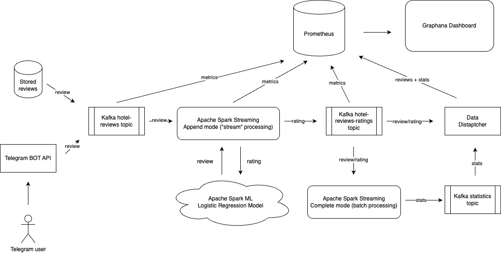

# Distributed Real-time Lambda Streaming Processing Pipeline

Content:
- [Distributed Real-time Lambda Streaming Processing Pipeline](#distributed-real-time-lambda-streaming-processing-pipeline)
  - [Description](#description)
  - [Architecture](#architecture)
  - [How to use it](#how-to-use-it)
  - [Acknowledgements](#acknowledgements)
  - [License](#license)

## Description
This project aims to be a learning experience for implementing Lambda streaming architecture for processing real-time data and use it in the real example.

The system represents a real-time hotel review stream pipeline. The pipeline itself gathers data from multiple data sources, assigns a rating to a hotel review in a stream matter, and calculates summary stats of hotel reviews in batch manner. The output is consumed by a timeseries database and is displayed on the dashboard.

## Architecture



The architecture contains of multiple datasources that are writing into the Apache Kafka queue:
* `Telegram Bot` represents a user client, where user could give a review of they stay in the hotel.
* `Stored reviews` emulates the another datasource with user reviews.

The project exploits the Apache Spark ability to process real-time data in 2 modes:
* `streaming` mode - read hotel review from the Kafka queue and predict a rating for this review using the ML model while working in the `append` mode.
* `batch processing` mode - calculate stats for hotel reviews while working in the `complete` mode using the stream operators and window functions.

Prometheus and Grafana is used to collect metrics and stream output data and display it on dashboards.

## How to use it

From the very beginning, the system is designed to work in distributed environment. However, it is possible to run it locally in the Docker environment. For that, the `docker-compose.yaml` file is present.

Firstly, the <a href="https://www.kaggle.com/datasets/andrewmvd/trip-advisor-hotel-reviews">dataset</a> is needed. Place it in the `data` folder and run the `src/split_dataset` in order to split the dataset and create the `reviews.json` to use as an external datasource.

Spin up the Docker environment using the `docker-compose up -d`.
**Important note:** create an API key in the Grafana, place it in the `config/prometheus/prometheus.yml` in the `remote_write` section to be able to write data into Grafana. For the Prometheus datasource in the Grafana allow authentication using credentials.

Then, train the ML model in the Spark environment using the:
```bash
/app/spark/classifier> $ sh run_job.sh
```

Once, the model is trained, start the rating prediction stream:
```bash
/app/spark> $ sh run_job.sh
```

Start the statistics calculation stream:
```bash
/app/spark/statistics> $ sh run_job.sh
```

The deployment contains Web UIs that could be used to inspect the work of the system in an interactive way:
* `localhost:3000` - Grafana UI
* `localhost:9090` - Prometheus UI
* `localhost:8088` - Kafka UI
* `localhost:8085` - Spark Master UI

## Acknowledgements
This project uses the dataset with hotel reviews that was taken from the <a href="https://www.kaggle.com/datasets/andrewmvd/trip-advisor-hotel-reviews">Kaggle</a> and is distributed under the `CC BY NC 4.0` license.

[1] Alam, M. H., Ryu, W.-J., Lee, S., 2016. Joint multi-grain topic sentiment: modeling semantic aspects for online reviews. Information Sciences 339, 206–223.

## License
The project was used for a learning purpose and is distributed as it is under the `MIT` license.
